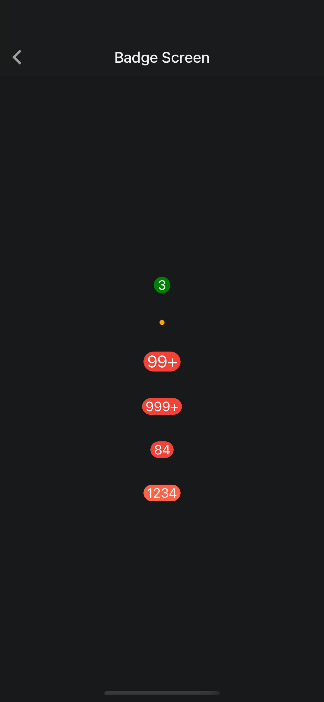

# @nghinv/react-native-badge

React Native Badge Library

---

[](https://circleci.com/gh/nghinv-software/react-native-badge)
[![Version][version-badge]][package]
[![MIT License][license-badge]][license]
[![All Contributors][all-contributors-badge]][all-contributors]
[![PRs Welcome][prs-welcome-badge]][prs-welcome]

<p align="center">

</p>

## Installation

```sh
yarn add @nghinv/react-native-badge
```

or 

```sh
npm install @nghinv/react-native-badge
```

## Usage

```js
import React from 'react';
import { View, StyleSheet } from 'react-native';
import Badge from '@nghinv/react-native-badge';

function App() {
  return (
    <View style={styles.container}>
      <Badge 
        backgroundColor='green' 
        containerStyle={styles.badge} 
        label="3" 
        size={20} 
        labelFormatterLimit={2} 
      />
      <Badge 
        backgroundColor='orange' 
        containerStyle={styles.badge} size='pimpleSmall' 
        labelFormatterLimit={2} 
      />
      <Badge 
        containerStyle={styles.badge} 
        label="1234" 
        size='large' 
        labelFormatterLimit={2} 
      />
      <Badge 
        containerStyle={styles.badge} 
        label="9999" 
        size={20} 
        labelFormatterLimit={3} 
      />
      <Badge 
        containerStyle={styles.badge} 
        label="84" 
        size={20} 
        labelFormatterLimit={2} 
      />
      <Badge 
        backgroundColor='tomato' 
        containerStyle={styles.badge} 
        label="1234" 
        size={20} 
        labelFormatterLimit={4} 
      />
    </View>
  );
}

const styles = StyleSheet.create({
  container: {
    flex: 1,
    justifyContent: 'center',
    alignItems: 'center',
  },
  badge: {
    margin: 16,
  },
});

export default App;
```

# Property

| Property | Type | Default | Description |
|----------|:----:|:-------:|-------------|
| label | `string` | `undefined` |  |
| size | `BadgeSizes \| number` | `20` |  |
| labelColor | `string` | `white` |  |
| backgroundColor | `string` | `#f44336` |  |
| containerStyle | `StyleProp<ViewStyle>` |  |
| labelStyle | `TextStyle` | `undefined` |  |
| labelFormatterLimit | `0 \| 1 \| 2 \| 3 \| 4` | `undefined` |  |
| labelProps | `TextProps` | `undefined` |  |


BadgeSizes = `pimpleSmall` | `pimpleBig` | `pimpleHuge` | `small` | `default` | `large`

---
## Credits

- [@Nghi-NV](https://github.com/Nghi-NV)

[version-badge]: https://img.shields.io/npm/v/@nghinv/react-native-badge.svg?style=flat-square
[package]: https://www.npmjs.com/package/@nghinv/react-native-badge
[license-badge]: https://img.shields.io/npm/l/@nghinv/react-native-badge.svg?style=flat-square
[license]: https://opensource.org/licenses/MIT
[all-contributors-badge]: https://img.shields.io/badge/all_contributors-1-orange.svg?style=flat-square
[all-contributors]: #contributors
[prs-welcome-badge]: https://img.shields.io/badge/PRs-welcome-brightgreen.svg?style=flat-square
[prs-welcome]: http://makeapullrequest.com
